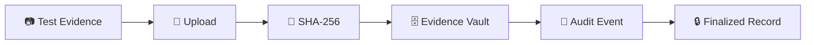
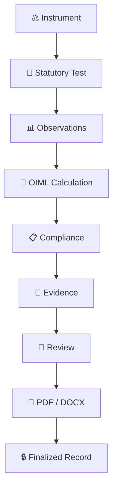

<div align="center">

<!-- ========================================================= -->
<!--                         HERO                              -->
<!-- ========================================================= -->

<br>

<h1>
  𓍝 <strong>Metri-Report</strong>
</h1>

<p>
  <strong>Smart OIML R-76 Statutory Testing & Legal Metrology Automation Platform</strong>
</p>


<a href="https://metri-report.vercel.app/">

</a>
&nbsp;&nbsp;
<a href="https://drive.google.com/file/d/1nsga1QCVMlIudqo0IhGJenXJBFIyrymS/view?usp=sharing">

</a>

&nbsp;&nbsp;
<a href="https://youtu.be/aikTO0FT_2c?si=wGvtQ1_y6iuLtcUi">

</a>

<br><br>


<br><br>

> **Measure • Validate • Verify • Report**

<br>


<br><br>

<sub>
<strong>SIH 2026 Prototype</strong> · Legal Metrology · Non-Automatic Weighing Instruments · OIML R-76
</sub>

</div>

---

# ⚖️ What is Metri-Report?

**Metri-Report** is a full-stack statutory testing and reporting platform designed for **Non-Automatic Weighing Instruments (NAWI)**.

The platform digitizes the workflow from:

**Instrument Registration → Test Configuration → Observation Entry → OIML Calculation → Compliance Evaluation → Evidence Sealing → Review → PDF/DOCX Report → Finalization**

The system is designed around **OIML Recommendation R 76-1:2006 (E)** and the **Legal Metrology (General) Rules, 2011**.

It brings statutory testing, metrological calculations, evidence management, role-based workflows and report generation into one unified platform.

---

# 🏛️ Smart India Hackathon 2026

<div align="center">

### 🇮🇳 Legal Metrology Automation · Metri-Report

<br>


<br><br>

</div>

| Field | Details |
|---|---|
| **Organization** | Department of Consumer Affairs, Ministry of Consumer Affairs, Food & Public Distribution, Government of India |
| **Problem Statement** | Development of a Software Program/Application for Generation of Test Reports for Non-Automatic Weighing Instruments (NAWI) as per OIML Recommendation R-76 |
| **Domain** | Legal Metrology |
| **Standard** | OIML R 76-1:2006 (E) |
| **Instrument Type** | Non-Automatic Weighing Instruments (NAWI) |
| **Project** | Metri-Report |
| **Status** | SIH 2026 Prototype |

---

# 📑 Project Presentation

<div align="center">

### 🏆 Metri-Report · Smart India Hackathon 2026

<br>


<br><br>

<a href="https://drive.google.com/file/d/1nsga1QCVMlIudqo0IhGJenXJBFIyrymS/view?usp=sharing">


</a>

<br><br>

<a href="https://drive.google.com/file/d/1nsga1QCVMlIudqo0IhGJenXJBFIyrymS/view?usp=sharing">


</a>

<br><br>

<sub>
Click the presentation preview or the button above to open the complete project presentation.
</sub>

</div>

---

# 🌐 Live Prototype

<div align="center">

### 🚀 Interactive Metri-Report Platform

<br>

<a href="https://metri-report.vercel.app/">


</a>

<br><br>

<a href="https://metri-report.vercel.app/">


</a>

<br><br>

<sub>
Click the preview or button above to open the live Metri-Report prototype.
</sub>

</div>

---

# 🎥 Project Videos

<div align="center">

### 🎬 Watch Metri-Report in Action

<br>

<table>
<tr>

<td align="center" width="50%">

### 🎞️ Short Explanation

<a href="https://youtu.be/aikTO0FT_2c?si=wGvtQ1_y6iuLtcUi">


</a>

<br><br>

<a href="https://youtu.be/aikTO0FT_2c?si=wGvtQ1_y6iuLtcUi">


</a>

<br>

<sub>Quick overview of the problem, solution and platform.</sub>

</td>

<td align="center" width="50%">

### 🖥️ Prototype Demo

<a href="https://youtu.be/I3D6fohmWKI?si=4KK4XNhP0dYcliJN">


</a>

<br><br>

<a href="https://youtu.be/I3D6fohmWKI?si=4KK4XNhP0dYcliJN">


</a>

<br>

<sub>Walkthrough of the working Metri-Report prototype.</sub>

</td>

</tr>
</table>

</div>

---

# 🧩 The Problem

Traditional statutory weighing-instrument testing involves multiple disconnected activities:

- Manual instrument registration
- Manual test configuration
- Physical observation recording
- Repeated metrological calculations
- Manual compliance interpretation
- Evidence handling
- Review and approval
- Preparation of statutory reports
- Maintaining audit history

This creates a workflow where **data, calculations, evidence and reports can become fragmented across different systems or manual records**.

Metri-Report brings these activities into one structured digital workflow.

---

# 🔄 From Manual Testing → Digital Statutory Workflow

<div align="center">

<table>
<tr>

<td align="center" width="20%">

### 🧾

**REGISTER**

<sub>
Instrument<br>
Specifications<br>
Manufacturer
</sub>

</td>

<td align="center" width="5%">

### →

</td>

<td align="center" width="20%">

### 🧪

**TEST**

<sub>
Conditions<br>
Observations<br>
Applicable Tests
</sub>

</td>

<td align="center" width="5%">

### →

</td>

<td align="center" width="20%">

### 🧮

**CALCULATE**

<sub>
MPE<br>
Turning Point<br>
Error Analysis
</sub>

</td>

<td align="center" width="5%">

### →

</td>

<td align="center" width="20%">

### 📋

**REPORT**

<sub>
PDF<br>
DOCX<br>
Compliance
</sub>

</td>

</tr>
</table>

<br>

<table>
<tr>

<td align="center" width="25%">

### 🔐

**EVIDENCE**

<sub>
SHA-256<br>
Photos<br>
Test Artifacts
</sub>

</td>

<td align="center" width="25%">

### 👥

**REVIEW**

<sub>
RBAC<br>
Approval<br>
Technical Review
</sub>

</td>

<td align="center" width="25%">

### 🧾

**AUDIT**

<sub>
Events<br>
Timestamps<br>
Immutable Logs
</sub>

</td>

<td align="center" width="25%">

### 🔒

**FINALIZE**

<sub>
Report Lock<br>
Versioning<br>
Integrity
</sub>

</td>

</tr>
</table>

</div>

---

# 💡 Problem → Solution

| Challenge | Metri-Report Solution |
|---|---|
| 📄 Manual report preparation | Automated PDF & DOCX report generation |
| 🧮 Repetitive calculations | Automated OIML calculation engine |
| ⚖️ Complex metrological rules | Versioned OIML rule engine |
| 🔍 Difficult traceability | Clause-level result explainability |
| 📷 Scattered evidence | Centralized evidence vault |
| 🔐 Evidence integrity concerns | SHA-256 cryptographic hashing |
| 👥 Multiple user responsibilities | Role-Based Access Control |
| 📝 Manual review workflow | Digital review and approval workflow |
| 🕒 Limited audit visibility | Immutable chronological audit trail |
| 📚 Changing standards | Versioned statutory rule architecture |

---

# ✨ Core Capabilities

<div align="center">

| ⚖️ METROLOGY | 🧮 CALCULATION | 🔐 INTEGRITY | 📄 REPORTING |
|---|---|---|---|
| NAWI Testing | MPE Calculation | SHA-256 Hashing | PDF Generation |
| OIML R-76 Rules | Turning Points | Evidence Vault | DOCX Generation |
| Accuracy Classes | Error Analysis | Audit Trail | Report Versioning |
| Verification Workflow | Compliance Logic | Immutable State | Statutory Format |

</div>

---

# 🏗️ System Architecture

```mermaid
flowchart TD

    USER["👤 Legal Metrology Officer / Engineer"]

    UI["🖥️ Metri-Report Web Interface<br/>HTML + CSS + JavaScript + Three.js"]

    GATEWAY["⚙️ Node.js Gateway<br/>Port 3000"]

    API["🚀 FastAPI Backend<br/>Port 8000"]

    AUTH["🔐 Authentication & RBAC"]

    VALIDATION["✅ Validation Layer"]

    RULES["📚 OIML R-76<br/>Versioned Rule Engine"]

    CALC["🧮 Metrological<br/>Calculation Engine"]

    REPORT["📄 PDF / DOCX<br/>Report Engine"]

    EVIDENCE["🔒 Evidence Vault<br/>SHA-256"]

    AUDIT["📜 Audit Trail"]

    DB[("🗄️ SQLite / PostgreSQL")]

    STORAGE["📁 File Storage<br/>Evidence + Reports"]

    USER --> UI
    UI --> GATEWAY
    GATEWAY --> API

    API --> AUTH
    API --> VALIDATION
    API --> RULES
    API --> CALC
    API --> REPORT
    API --> EVIDENCE
    API --> AUDIT

    AUTH --> DB
    VALIDATION --> DB
    RULES --> DB
    CALC --> DB
    REPORT --> DB
    EVIDENCE --> DB
    AUDIT --> DB

    EVIDENCE --> STORAGE
    REPORT --> STORAGE
````

---

# 🔬 OIML R-76 Compliance Engine

Metri-Report is structured around **OIML Recommendation R 76-1:2006 (E)** and associated statutory testing requirements.

### 📐 Turning Point Calculation

The platform implements the changeover turning point calculation:

$$
P = I + 0.5e - \Delta L
$$

Where:

* `P` = calculated turning point
* `I` = indicated value
* `e` = verification scale interval
* `ΔL` = additional load

### 📊 Error Calculation

$$
E = P - L
$$

Corrected error:

$$
E_c = E - E_0
$$

Where:

* `E` = error
* `L` = applied load
* `E₀` = zero error
* `E_c` = corrected error

---

# 📚 Statutory Rule Coverage

The platform organizes statutory requirements into a versioned rule system covering areas including:

* Accuracy classes
* Verification scale interval
* Maximum Permissible Error
* Turning point / changeover calculations
* Zero error
* Repeatability
* Eccentricity
* Creep
* Discrimination
* Tare
* Influence factors
* Evidence integrity
* Report generation

The system is designed so that ambiguous or unconfigured requirements can be surfaced instead of silently producing unsupported results.

> **MANUAL REVIEW REQUIRED** and **NOT CONFIGURED** states are used where applicable.

---

# 🧮 Calculation & Verification Pipeline

```mermaid
flowchart LR

    A["⚖️ Instrument<br/>Specifications"]

    B["🧪 Test<br/>Observations"]

    C["📚 Applicable<br/>OIML Rules"]

    D["🧮 Calculation<br/>Engine"]

    E["📊 Error + MPE<br/>Evaluation"]

    F{"Compliance<br/>Check"}

    G["🟢 PASS"]

    H["🔴 FAIL"]

    I["🟡 MANUAL REVIEW"]

    A --> D
    B --> D
    C --> D

    D --> E
    E --> F

    F -->|Within Limit| G
    F -->|Outside Limit| H
    F -->|Ambiguous / Missing| I
```

---

# 🧾 Statutory Testing Modules

| Module                        | Purpose                                                   |
| ----------------------------- | --------------------------------------------------------- |
| 🏠 **Homepage**               | 3D WebGL interface, navigation and platform overview      |
| ⚖️ **Instrument Registry**    | Register NAWI instruments and metrological specifications |
| 🧪 **Evaluation Workspace**   | Execute the statutory evaluation workflow                 |
| 📊 **Report Archive**         | Store, verify and retrieve generated reports              |
| 🔐 **Evidence & Vault**       | Store evidence and generate cryptographic hashes          |
| 👥 **User Privileges & RBAC** | Manage user roles and permissions                         |
| 📜 **Audit Trail Log**        | Inspect chronological system events                       |
| 📚 **OIML Rule Engine**       | Inspect and manage statutory rules                        |
| 📖 **Swagger API Docs**       | Explore backend REST APIs                                 |

---

# 🧪 Evaluation Workspace

The Evaluation Workspace provides a structured statutory testing workflow.

### Typical workflow

```text
Instrument
    ↓
Test Conditions
    ↓
Applicable Tests
    ↓
Observations
    ↓
Calculations
    ↓
Compliance
    ↓
Evidence
    ↓
Review
    ↓
Report Generation
    ↓
Finalization
```

The system supports:

* Instrument specification entry
* Environmental conditions
* Applicable test selection
* Observation entry
* Metrological calculations
* Compliance evaluation
* Evidence upload
* Reviewer observations
* PDF/DOCX generation
* Report finalization

---

# 🔐 Evidence & Cryptographic Integrity

Metri-Report includes an evidence workflow designed around cryptographic integrity.

### Evidence lifecycle



Evidence can include:

* Calibration certificates
* Test photographs
* Raw testing artifacts
* Supporting documents
* Other statutory evidence

The generated cryptographic digest can be used to detect unexpected evidence modification.

---

# 👥 Role-Based Access Control

Metri-Report uses role-based access control for different statutory responsibilities.

| Role              | Primary Responsibility                                       |
| ----------------- | ------------------------------------------------------------ |
| **ADMIN**         | Administration, roles, configuration and finalization        |
| **LAB_MANAGER**   | Instrument management, test assignment and workflow approval |
| **TEST_ENGINEER** | Test execution, observations and evidence                    |
| **REVIEWER**      | Calculation review and technical approval                    |
| **VIEWER**        | Read-only access to repository and audit information         |

---

# 📄 Automated Report Generation

Metri-Report provides automated generation of:

### PDF

* Structured statutory test report
* Metrological tables
* Compliance results
* Testing information
* Evidence references
* Disclaimers

### DOCX

* Editable evaluation package
* Structured laboratory record
* Test information
* Calculation results
* Review information

The report engine is based on:

* **ReportLab**
* **python-docx**

---

# 📜 Audit Trail

The Audit Trail provides chronological visibility into system activity.

Captured information can include:

* Event type
* Timestamp
* User
* Action
* Test/report context
* Event payload
* Related system state

This supports traceability across the evaluation lifecycle.

---

# 🗂️ Project Structure

```text
MetriReport/
│
├── backend/
│   ├── app/
│   │   ├── api/
│   │   ├── calculations/
│   │   ├── compliance/
│   │   ├── core/
│   │   ├── models/
│   │   ├── reports/
│   │   ├── schemas/
│   │   ├── services/
│   │   └── tests/
│   │
│   └── requirements.txt
│
├── frontend/
│   ├── index.html
│   ├── evaluation-workspace/
│   ├── instrument-registry/
│   ├── report-archive/
│   ├── evidence-&-vault/
│   ├── user-privileges-&-rbac/
│   ├── audit-trail-log/
│   ├── OIML-Rule-Engine/
│   ├── server.js
│   ├── subpage-shell.css
│   ├── fonts/
│   └── assets/
│
├── docs/
│
└── README.md
```

---

# 🧱 Technology Stack

<div align="center">

| Layer                 | Technology              |
| --------------------- | ----------------------- |
| **Frontend**          | HTML5, CSS3, JavaScript |
| **3D / Graphics**     | Three.js, WebGL, GLTF   |
| **Frontend Gateway**  | Node.js                 |
| **Backend**           | FastAPI                 |
| **Language**          | Python                  |
| **Validation**        | Pydantic                |
| **ORM**               | SQLAlchemy 2.0          |
| **Database**          | SQLite / PostgreSQL     |
| **Reports**           | ReportLab, python-docx  |
| **Security**          | JWT, Password Hashing   |
| **Integrity**         | SHA-256                 |
| **Testing**           | Pytest                  |
| **Deployment**        | Docker / Docker Compose |
| **Prototype Hosting** | Vercel                  |

</div>

---

# 🚀 Getting Started

## Prerequisites

* Python 3.9+
* Node.js 18+
* npm
* Git
* Docker *(optional)*

---

## Backend Setup

```bash
cd backend

python3 -m venv venv

source venv/bin/activate

pip install -r requirements.txt

PYTHONPATH=. uvicorn app.main:app --reload --port 8000
```

Backend:

```text
http://localhost:8000
```

Swagger:

```text
http://localhost:8000/docs
```

---

## Frontend Setup

```bash
cd frontend

npm install

node server.js
```

Frontend:

```text
http://localhost:3000
```

---

# 🧪 Run Automated Tests

Run the backend test suite:

```bash
cd backend

python3 -m pytest app/tests/ -v
```

The test suite covers areas such as:

* Calculation logic
* Boundary conditions
* Compliance
* Security
* Report generation
* Integration behavior

---

# 🐳 Docker Deployment

Build and start the complete stack:

```bash
docker compose up --build
```

Services:

| Service         | URL                          |
| --------------- | ---------------------------- |
| Frontend        | `http://localhost:3000`      |
| Backend         | `http://localhost:8000`      |
| Swagger         | `http://localhost:3000/docs` |
| Backend Swagger | `http://localhost:8000/docs` |

---

# 🎬 SIH 2026 Demo Flow

A concise demonstration can follow this sequence:

### 01 · Login

Use one of the available demo roles.

### 02 · Dashboard

Inspect platform metrics and navigation.

### 03 · Instrument Registry

Select or create a NAWI instrument.

### 04 · Evaluation Workspace

Launch a statutory evaluation.

### 05 · Test Configuration

Configure conditions and applicable tests.

### 06 · Observations

Enter or load test observations.

### 07 · Calculations

Run the OIML calculation engine.

### 08 · Compliance

Review permissible limits, calculated values and status.

### 09 · Evidence

Upload supporting evidence and generate SHA-256 hashes.

### 10 · Review

Reviewer verifies calculations and observations.

### 11 · Report

Generate the PDF/DOCX evaluation report.

### 12 · Finalize

Finalize and lock the statutory record.

---

# 🧭 End-to-End Intelligence Flow



---

# 📱 Responsive UI / UX

Metri-Report includes responsive interface work for compact mobile viewports.

### Mobile-focused improvements

* Compact navigation
* Responsive module layouts
* Touch-friendly controls
* Responsive evaluation forms
* Mobile-friendly evidence upload
* Horizontal scrolling for large statutory tables
* Adaptive spacing and typography
* Compact dashboard components

The frontend architecture is designed to preserve usability across desktop and mobile layouts.

---

# 🔒 Security & Integrity

Metri-Report incorporates several security-oriented mechanisms:

* 🔑 JWT authentication
* 👥 Role-Based Access Control
* 🔐 Password hashing
* 🌐 CORS controls
* 🧾 Audit logging
* 🔒 SHA-256 evidence hashing
* 🗄️ Controlled report storage
* 🔒 Finalized report immutability workflow
* 🧩 Environment-based configuration

> Never commit production credentials, secrets, private keys or sensitive deployment configuration to the repository.

---

# 🧠 Design Philosophy

<div align="center">

### **Measure → Validate → Explain → Report**

<br>

<table>
<tr>

<td align="center" width="25%">

### ⚖️

<b>MEASURE</b>

<br>

<sub>
Capture statutory<br>
test observations
</sub>

</td>

<td align="center" width="25%">

### 🧮

<b>VALIDATE</b>

<br>

<sub>
Apply OIML rules<br>
and calculations
</sub>

</td>

<td align="center" width="25%">

### 🔍

<b>EXPLAIN</b>

<br>

<sub>
Expose values,<br>
limits and references
</sub>

</td>

<td align="center" width="25%">

### 📄

<b>REPORT</b>

<br>

<sub>
Generate structured<br>
statutory documents
</sub>

</td>

</tr>
</table>

<br>


</div>

---

# 🗺️ Roadmap

```text
Metri-Report
│
├── ⚖️ Metrology
│   ├── Expanded statutory rule coverage
│   ├── Additional test workflows
│   └── Extended instrument support
│
├── 🧮 Calculation Engine
│   ├── More verification scenarios
│   ├── Extended boundary testing
│   └── Additional mathematical validation
│
├── 📄 Reporting
│   ├── More statutory report templates
│   ├── Enhanced report versioning
│   └── Digital verification workflows
│
├── 🔐 Integrity
│   ├── Stronger evidence lifecycle
│   ├── Advanced audit controls
│   └── Extended verification mechanisms
│
└── ☁️ Deployment
    ├── Production database support
    ├── Scalable storage
    └── Cloud deployment
```

---

# ⚠️ Legal Metrology Disclaimer

> **IMPORTANT NOTICE:** Metri-Report is a prototype system developed for SIH 2026. It is intended to demonstrate digital automation of NAWI testing and report-generation workflows based on configured OIML R-76 requirements.
>
> The prototype does **not** by itself constitute statutory Legal Metrology Model Approval, certification or gazette notification under applicable Indian law.
>
> Actual statutory decisions, approvals and certifications remain subject to the competent authority, applicable legislation, notified rules, standards and authorized metrological procedures.

---

# 👨‍💻 Project

<div align="center">

### 𓍝 **Metri-Report**

<br>

<strong>OIML R-76 · Legal Metrology · Statutory Testing · Digital Reporting</strong>

<br><br>

<a href="https://metri-report.vercel.app/">

</a>

 

<a href="https://drive.google.com/file/d/1nsga1QCVMlIudqo0IhGJenXJBFIyrymS/view?usp=sharing">

</a>

 

<a href="https://youtu.be/aikTO0FT_2c?si=wGvtQ1_y6iuLtcUi">

</a>

<br><br>

<sub>
Built for statutory testing automation, traceability and digital legal metrology workflows.
</sub>

<br><br>


<br><br>

⭐ <strong>If you find Metri-Report useful, consider starring the repository.</strong>

</div>

---

<div align="center">

<sub>

**𓍝 Metri-Report**

<br>

**Smart OIML R-76 Statutory Testing & Legal Metrology Automation Platform**

</sub>

</div>
