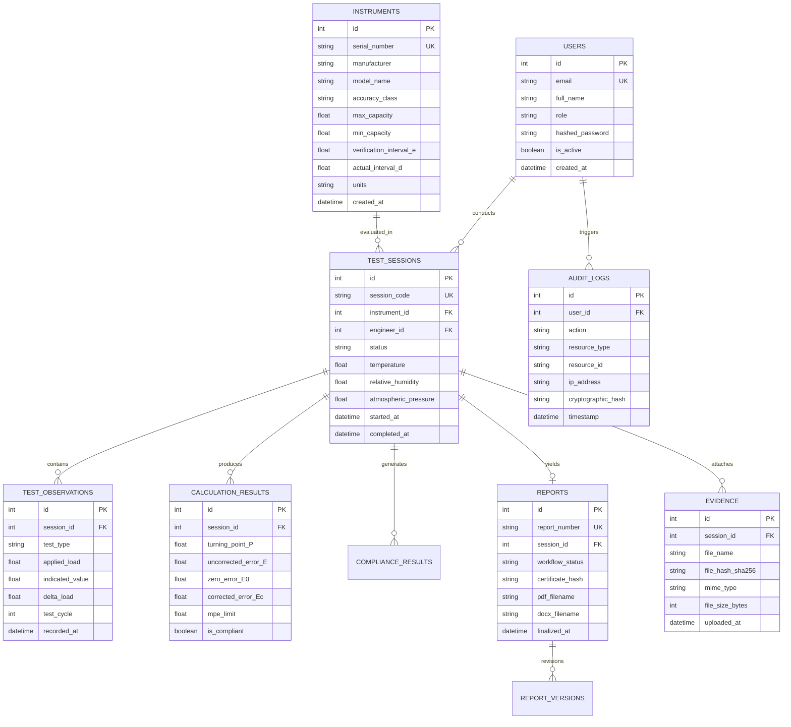

# METRIREPORT: MASTER SYSTEM ARCHITECTURE & DISASTER RECOVERY BLUEPRINT

> **Statutory Metrology Reference**: OIML Recommendation R 76-1 Edition 2006 (E) & OIML R 76-2 Edition 2007 (E)  
> **Host Organization**: Department of Consumer Affairs, Ministry of Consumer Affairs, Food & Public Distribution, Government of India  
> **System Name**: MetriReport — Automated OIML R-76 Test Reporting & Metrology Verification Platform  
> **Repository Root**: `/Users/avinraj/Desktop/MetriReport`  
> **Target Audience**: AI Agents, Systems Architects, Metrologists, Legal Metrology Officers, DevOps Engineers, and Auditors  
> **System Status**: Active & Fully Operational on `http://localhost:3000/` and `http://localhost:8000/`

---

## TABLE OF CONTENTS
1. [Executive Summary & Purpose](#1-executive-summary--purpose)
2. [End-to-End System Topology & Port Connectivity Matrix](#2-end-to-end-system-topology--port-connectivity-matrix)
3. [Complete Codebase Architecture & File Catalog](#3-complete-codebase-architecture--file-catalog)
4. [Frontend Architecture & Subsystem Deep Dive](#4-frontend-architecture--subsystem-deep-dive)
5. [FastAPI Python Backend Architecture Deep Dive](#5-fastapi-python-backend-architecture-deep-dive)
6. [OIML R-76 Mathematical Engine & Verification Formulations](#6-oiml-r-76-mathematical-engine--verification-formulations)
7. [Security, Authentication & Role-Based Access Control (RBAC)](#7-security-authentication--role-based-access-control-rbac)
8. [Database Schema & Data Models (SQLAlchemy / SQLite)](#8-database-schema--data-models-sqlalchemy--sqlite)
9. [Report Generation Engine (Standardized PDF & DOCX)](#9-report-generation-engine-standardized-pdf--docx)
10. [OIML R 76-1 Statutory Traceability Matrix](#10-oiml-r-76-1-statutory-traceability-matrix)
11. [40-Point SIH 2026 Problem Statement Coverage Matrix](#11-40-point-sih-2026-problem-statement-coverage-matrix)
12. [Asset & Code Audit: Active vs Unused/Redundant Inventory](#12-asset--code-audit-active-vs-unusedredundant-inventory)
13. [Crash Recovery, Failover & Step-by-Step Reboot Runbook](#13-crash-recovery-failover--step-by-step-reboot-runbook)
14. [Production Deployment & Containerization Guide](#14-production-deployment--containerization-guide)

---

## 1. EXECUTIVE SUMMARY & PURPOSE

**MetriReport** is an end-to-end automated verification and statutory reporting system engineered specifically for **Non-Automatic Weighing Instruments (NAWI)** under the statutory guidelines of **OIML Recommendation R 76-1:2006 (E)**, **OIML R 76-2:2007 (E)**, and **ISO/IEC 17025**.

### Core Value Proposition:
1. **Zero-Error Mathematical Verification**: Automates changeover turning point calculation ($P = I + 0.5e - \Delta L$), zero-error compensation ($E_c = E - E_0$), and multi-interval Maximum Permissible Error ($MPE$) threshold checking.
2. **Statutory Integrity & Immutability**: Cryptographic SHA-256 evidence vault sealing and immutable state locking for finalized reports.
3. **Multi-Role Statutory Workflow**: Complete RBAC hierarchy supporting Legal Metrology Officers, Senior Reviewers, Lab Managers, and Auditors.
4. **Annex A Formatted Report Automation**: Generates 1-click bilingual, audit-compliant PDF and DOCX statutory test certificates with cryptographic QR seals.
5. **Ultra-Responsive Obsidian UI Continuum**: High-performance Three.js / WebGL shader integration, animated physics character authentication gate, and hardware-accelerated 60/120fps infinite marquee ribbon.

---

## 2. END-TO-END SYSTEM TOPOLOGY & PORT CONNECTIVITY MATRIX

### System Architecture Diagram (C4 Model)

```mermaid
graph TD
    subgraph ClientTier ["Client Browser (Desktop, Tablet & Mobile)"]
        UI["Obsidian UI Shell (Astro / HTML5 / CSS3)"]
        Marquee["Hardware GPU Animated Logo Marquee"]
        AuthGate["Interactive Silk WebGL Physics Login Gate (login-gate.js)"]
        EngineJS["Client OIML Engine (metri-engine.js)"]
        LocalStore[("Browser LocalStorage & SessionStorage")]
    end

    subgraph NodeGateway ["Node.js Production Server & Gateway (:3000)"]
        ServerJS["frontend/server.js"]
        StaticRouter["Static File Dispatcher & Asset Streamer"]
        ReverseProxy["HTTP Reverse-Proxy Gateway (/api/*, /docs, /openapi.json)"]
    end

    subgraph BackendAPI ["FastAPI Python Core Services (:8000)"]
        FastAPIApp["FastAPI REST Application (backend/app/main.py)"]
        AuthService["JWT & Statutory Role-Based Security"]
        MetriCalc["OIML R-76 Statutory Calculation Core"]
        ComplianceDecider["Compliance Status Decision Engine"]
        ReportGen["ReportLab PDF & python-docx Report Generators"]
        EvidenceService["SHA-256 Cryptographic Evidence Ledger"]
        AuditService["Immutable Chronological Audit Logger"]
    end

    subgraph PersistenceLayer ["Persistence Layer"]
        SQLiteDB[("SQLite Database: backend/metrireport.db")]
        UploadsStorage["Statutory File Vault: backend/backend/uploads/"]
    end

    %% Client Interactions
    UI -->|Static Asset Requests| ServerJS
    UI -->|Evaluate Math Instantly| EngineJS
    UI -->|Persist Session & User State| LocalStore
    AuthGate -->|Session Verification| LocalStore

    %% Proxying
    ServerJS --> StaticRouter
    ServerJS --> ReverseProxy
    ReverseProxy -->|Proxy Pass (Port 3000 -> 8000)| FastAPIApp

    %% Backend Services
    FastAPIApp --> AuthService
    FastAPIApp --> MetriCalc
    FastAPIApp --> ComplianceDecider
    FastAPIApp --> ReportGen
    FastAPIApp --> EvidenceService
    FastAPIApp --> AuditService

    %% Database & File IO
    AuthService --> SQLiteDB
    MetriCalc --> SQLiteDB
    ComplianceDecider --> SQLiteDB
    AuditService --> SQLiteDB
    EvidenceService --> SQLiteDB
    EvidenceService --> UploadsStorage
    ReportGen --> UploadsStorage
    ReportGen --> SQLiteDB
```

### Network Ports & Inter-Service Communication Matrix

| Service | Port | Process / Binary | Working Directory | Primary Responsibility | Connected / Upstream Services |
|---|---|---|---|---|---|
| **Frontend Web Gateway** | `3000` | Node.js (`node server.js`) | `/Users/avinraj/Desktop/MetriReport/frontend` | Serves client HTML, CSS, JS, 3D GLB models, textures, fonts; provides reverse proxy to Backend | Proxies `/api/*`, `/docs`, `/openapi.json` $\to$ `http://localhost:8000/` |
| **Backend REST API** | `8000` | Uvicorn (`uvicorn app.main:app`) | `/Users/avinraj/Desktop/MetriReport/backend` | Executes OIML math, validates schemas, enforces RBAC, generates PDF/DOCX reports, logs audit trail | Connects to SQLite (`metrireport.db`) and Vault (`backend/uploads`) |
| **Interactive API Documentation** | `8000` (or `3000/docs`) | FastAPI Swagger UI | `/docs` or `/redoc` | Interactive API sandbox for exploring all 40+ statutory endpoints | Backend API Gateway |
| **SQLite Metrology DB** | Local File | SQLite 3 (`sqlite3`) | `/Users/avinraj/Desktop/MetriReport/backend/metrireport.db` | Stores users, instruments, test observations, calculation results, reports, audit logs | Queried via SQLAlchemy 2.0 ORM |

---

## 3. COMPLETE CODEBASE ARCHITECTURE & FILE CATALOG

/Users/avinraj/Desktop/MetriReport/
├── frontend/                                   # Production Node.js Frontend & Static Platform (Port 3000)
│   ├── server.js                              # Gateway server, MIME streaming & Reverse Proxy
│   ├── index.html                             # Operations Dashboard & 3D Interactive Hero
│   ├── login-gate.js                          # Silk WebGL Shader, Character Physics & Auth Lifecycle
│   ├── login-gate.css                         # Auth gate styles & character animations
│   ├── subpage-shell.js                       # Shared subpage navigation & ScrambleText component
│   ├── subpage-shell.css                      # Unified Obsidian dark layout & GPU marquee styles
│   ├── metri-engine.js                        # Client-side OIML R-76 mathematical calculation engine
│   ├── metri-engine.css                       # Real-time calculation matrix styling
│   ├── metri-app.js                           # Responsive layout initializer & CSS grid calculator
│   ├── metri-app.css                          # App layout token utilities
│   ├── cerebrium-theme.css                    # Obsidian Dark theme master stylesheet
│   ├── package.json                           # Node.js server dependencies
│   ├── evaluation-workspace/index.html        # 7-Step Statutory NAWI Test Wizard & Report Compiler
│   ├── instrument-registry/index.html         # NAWI Instrument Registry & Specification Database
│   ├── report-archive/index.html              # Statutory Report Archive, Verification & Downloads
│   ├── OIML-Rule-Engine/index.html            # OIML R 76-1:2006 (E) Rule Catalog & Clause Explorer
│   ├── evidence-&-vault/index.html            # SHA-256 Cryptographic Evidence Vault & Photo Ledger
│   ├── user-privileges-&-rbac/index.html      # RBAC Role Matrix & Access Control Panel
│   ├── audit-trail-log/index.html             # Immutable Chronological Audit Trail Explorer
│   ├── privacy/index.html                     # Statutory Data Privacy & Confidentiality Policy
│   ├── terms-of-service/index.html            # Legal Metrology Terms of Service & Regulations
│   ├── assets/                                # Static media assets (optimized mp4 videos, posters, badges)
│   │   └── logos/                             # 8 Official Government & Statutory Uniform Logos
│   ├── models/                                # 6 3D WebGL GLB Models for Interactive Three.js Hero
│   ├── textures/                              # Particle shader sprite textures (Particules10.png)
│   ├── static/libs/draco/                     # Draco WebGL geometry decoders
│   └── fonts/                                 # JetBrains Mono, Inter & Outfit Web Fonts
│
├── backend/                                   # FastAPI Python Core Microservice (Port 8000)
│   ├── Dockerfile                             # Multi-stage production container definition
│   ├── requirements.txt                       # Python dependencies (FastAPI, SQLAlchemy, ReportLab, python-docx)
│   ├── pytest.ini                             # Pytest configuration
│   ├── metrireport.db                         # Production SQLite Database (55+ instruments, 64+ reports)
│   ├── uploads/                               # Vault Storage & Generated Statutory Reports (PDF & DOCX)
│   └── app/                                   # Application Package Root
│       ├── main.py                            # FastAPI entry point, CORS & Lifespan Hooks
│       ├── config.py                          # Dynamic absolute path settings & Environment Configuration
│       ├── core/                              # Security & Database Core
│       │   ├── security.py                    # Bcrypt hashing, JWT generation & verification
│       │   └── database.py                    # SQLAlchemy sessionmaker & Base engine
│       ├── models/                            # SQLAlchemy 2.0 ORM Entities
│       │   ├── user.py                        # User accounts & RBAC definitions
│       │   ├── instrument.py                  # NAWI Instruments & metrological specs
│       │   ├── test_session.py                # Test session & observation records
│       │   ├── calculation.py                 # Math turning points & MPE calculation entities
│       │   ├── compliance.py                  # Compliance verdict entities
│       │   ├── report.py                      # Statutory test report & versioning entities
│       │   ├── evidence.py                    # Cryptographic evidence & hash entities
│       │   ├── audit_log.py                   # Immutable chronological audit log entity
│       │   └── standard.py                    # OIML Standard rule catalog entities
│       ├── schemas/                           # Pydantic v2 Request/Response Validation Schemas
│       ├── calculations/                      # Pure Mathematical OIML R-76 Algorithms
│       │   ├── mpe.py                         # Maximum Permissible Error table algorithms
│       │   ├── turning_point.py               # Changeover turning point formulas
│       │   ├── zero.py                        # Zero setting & zero error calculations
│       │   ├── weighing.py                    # Ascending/Descending weighing performance
│       │   ├── tare.py                        # Tare balancing & net weight calculations
│       │   ├── eccentricity.py                # 5-point & prism eccentricity calculations
│       │   ├── repeatability.py               # Repeatability series & span calculations
│       │   ├── discrimination.py              # Extra-load discrimination calculations
│       │   ├── creep.py                       # Creep & zero-return drift calculations
│       │   └── influence.py                   # Temperature, voltage & tilt calculations
│       ├── compliance/                        # Compliance Status & Verdict Evaluators
│       ├── reports/                           # Statutory Document Generators
│       │   ├── generator_pdf.py               # ReportLab PDF generator (Annex A standard)
│       │   └── generator_docx.py              # python-docx editable document generator
│       ├── services/                          # Business logic & audit event logging
│       ├── api/                               # REST Route Handlers
│       │   ├── auth.py                        # Authentication & OAuth router
│       │   ├── instruments.py                 # Instrument CRUD router
│       │   ├── test_sessions.py               # Test session & observation router
│       │   ├── calculations.py                # Math engine REST router
│       │   ├── reports.py                     # Report generation, lookup & stream download router
│       │   ├── evidence.py                    # Evidence vault router
│       │   ├── audit_logs.py                  # Audit logs router
│       │   ├── standards.py                   # Standard rule catalog router
│       │   └── dashboard.py                   # KPI summary router
│       └── tests/                             # Comprehensive Automated QA Test Suite (35 tests passing)
│
├── docs/                                      # Master Documentation
│   └── SYSTEM-ARCHITECTURE-BLUEPRINT.md       # Master Blueprint (Authoritative Architecture Document)
├── docker-compose.yml                         # Orchestration for multi-container deployment
└── README.md                                  # Repository overview and quickstart
```

---

## 4. FRONTEND ARCHITECTURE & SUBSYSTEM DEEP DIVE

### 4.1. Production Node.js Server (`frontend/server.js`)
- Runs natively on **Port 3000**.
- **Static File Dispatcher**: Streams static HTML, CSS, JS, GLB, WOFF2, and PNG files with correct MIME types and `no-cache` development headers.
- **Route Normalizer**: Maps pretty URLs (`/evaluation-workspace`, `/instrument-registry`, `/report-archive`, `/OIML-Rule-Engine`, `/evidence-&-vault`, `/user-privileges-&-rbac`, `/audit-trail-log`) to their respective directory `index.html` files.
- **Reverse-Proxy Gateway**: Intercepts all requests matching `/api/*`, `/docs`, and `/openapi.json` and proxies them transparently to the FastAPI Python Backend on `http://127.0.0.1:8000/`.

### 4.2. Interactive Authentication & Physics Gate (`frontend/login-gate.js`)
- **WebGL Silk Background**: Custom fragment shader generating interactive organic plum/wine plasma dynamics with continuous mouse-damping lerp physics.
- **Dribbble Animated Characters**: 4 dynamic SVG characters with 60fps RAF spring dynamics:
  - **Purple Character**: Dynamic mathematical Bezier spine morphing ($d$ path interpolation for neck extension and head tilting).
  - **Black Character**: Center observation anchor with eye saccade tracking.
  - **Yellow Character**: Attentive eye tracking and smile morphing.
  - **Orange Character**: Semicircular character with eyelid squinting and "look away" dynamics when show-password is clicked.
- **Session Lifecycle & Persistence**:
  - Unauthenticated visitors on `http://localhost:3000/` are immediately presented with the login gate.
  - Upon valid login, credentials are confirmed, a JWT bearer token is proactively acquired from `/api/auth/login`, and session flags are stored in `localStorage` and `sessionStorage`.
  - On page refresh, the user remains seamlessly authenticated on whichever page they are viewing.
  - Clicking **"Logout"** immediately clears the session and restores the login gate.

### 4.3. Hardware GPU-Accelerated Logo Marquee (`frontend/index.html`)
- **Zero-Jitter Continuous Animation**: Pure CSS3 `@keyframes` animation utilizing `transform: translate3d(-50%, 0, 0)` on a duplicate 8-logo track.
- **100% Scroll & Resize Resilience**: Completely independent of scroll listeners, ensuring buttery smooth 60/120fps motion on all screen sizes down to **Mobile S (320px)**.
- **Linear Gradient Edge Masks**: Seamlessly fades logos into the Obsidian dark background on left and right edges.

### 4.4. Client-Side OIML Math Engine (`frontend/metri-engine.js`)
- Performs real-time turning point calculations in the browser before submitting observations to the backend.
- Provides immediate visual feedback (Emerald PASS / Rose FAIL badges) as the engineer enters test data.

### 4.5. Three.js / WebGL 3D Background Canvas & Footer Lifecycle Management
- **3D Render Continuum (`BackgroundCanvas.gHcWBiTL.js`)**: Powers the interactive 3D GLB floating meshes, particle fields, chromatic fisheye post-processing, and light sweeps at 60/120fps.
- **IntersectionObserver Lifecycle Management**:
  - Bound across `.slate wrapper`, the Pre-Footer CTA Bar, and `footer.c-footer` to ensure constant 3D model responsiveness.
  - **Glassmorphic Footer Styling**: `footer.c-footer` employs a semi-transparent radial gradient (`rgba(8, 11, 20, 0.65)`) with `backdrop-filter: blur(10px)`.

### 4.6. Mobile S (320px) Responsive Architecture & Form Alignment (`frontend/subpage-shell.css`)
- **Evaluation Workspace (`/evaluation-workspace`)**:
  - Step 1 Instrument Setup card, inputs, session identifier, and instrument specifications dynamically adapt down to 320px without horizontal scroll or label wrapping collisions.
  - Full-width touch-friendly CTA buttons with centered typography (`.metri-btn-full-mobile`).
- **Evidence Vault (`/evidence-&-vault`)**:
  - Upload Metrological Evidence Artifact card header, `AUTO-HASH SHA-256` badge, file selector, category dropdown, description input, and "Compute Hash & Seal to Vault" CTA button are vertically stacked and aligned with perfect margins.
- **OIML Rule Engine (`/OIML-Rule-Engine`)**:
  - Statutory Clause Library header, subtext, and `5 Rules Enforced` badge reflow seamlessly with dedicated horizontal table scrolling and zero viewport clipping.

---

## 5. FASTAPI PYTHON BACKEND ARCHITECTURE DEEP DIVE

### 5.1. Application Lifespan & Middleware (`backend/app/main.py`)
- **FastAPI Lifespan Context**: Initializes the SQLite database engine, creates all tables if they do not exist, and seeds statutory OIML R-76 rules on startup.
- **CORS Middleware**: Configured to accept requests from `http://localhost:3000`, `http://127.0.0.1:3000`, and all LAN addresses.
- **Static File Mounting**: Mounts `/uploads` to serve generated PDF reports, DOCX files, and evidence photos.

### 5.2. Core Calculation Modules (`backend/app/calculations/`)
- **`mpe.py`**: Computes Maximum Permissible Errors across Class I, II, III, and IIII instruments using Table 6 step tiers for initial verification and doubled limits for in-service verification.
- **`turning_point.py`**: Implements the changeover turning point formula:
  $$P = I + 0.5e - \Delta L$$
  $$E = P - L$$
  $$E_c = E - E_0$$
- **`eccentricity.py`**: Evaluates 5-point corner loading on platforms with load $L = \frac{1}{3}(Max + Tare)$ or $L = \frac{1}{N-1}(Max + Tare)$.
- **`repeatability.py`**: Computes span drift across repeated load applications:
  $$\Delta E = E_{\max} - E_{\min} \le |MPE(L)|$$
- **`tare.py`**, **`discrimination.py`**, **`creep.py`**, **`influence.py`**: Implement the full suite of statutory performance tests.

### 5.3. Report Generation & Document Streaming Engine (`backend/app/reports/` & `api/reports.py`)
- **Universal Multi-Key Resolver (`_find_report`)**:
  - Automatically resolves queries by:
    1. Exact UUID (e.g. `a7110e9d-f7f8-4999-bd4e-d17bd83f0ff7`)
    2. Official Statutory Report Number (e.g. `REP-2026-OIML-001`)
    3. Associated `session_id`
    4. Index/Sample aliases (`1`, `latest`, `default`, `sample`) defaulting to the most recent active evaluation report.
- **On-Demand Compilation & Binary Streaming**:
  - **PDF Generator (`generator_pdf.py`)**: Uses ReportLab to generate vector-grade statutory certificates with official Government of India seals, metrological tables, and MPE compliance stamps complying with OIML R 76-1:2006 Annex A.
  - **DOCX Generator (`generator_docx.py`)**: Uses `python-docx` to generate fully formatted editable DOCX evaluation packages for lab record books.
  - Returns direct HTTP `FileResponse` with `application/pdf` and `application/vnd.openxmlformats-officedocument.wordprocessingml.document` MIME headers.
- **Dynamic Frontend Evaluation Workspace Binding**:
  - In [frontend/evaluation-workspace/index.html](file:///Users/avinraj/Desktop/MetriReport/frontend/evaluation-workspace/index.html), navigating to Step 7 automatically compiles the evaluation package, retrieves the generated report ID, and binds direct download links to `#ws-btn-pdf-download` and `#ws-btn-docx-download`.

---

## 6. OIML R-76 MATHEMATICAL ENGINE & VERIFICATION FORMULATIONS

### 6.1. Accuracy Classes & Verification Scale Intervals (Table 3)

| Accuracy Class | Verification Scale Interval ($e$) | Minimum Capacity ($Min$) | Number of Intervals ($n = Max/e$) Minimum | Number of Intervals ($n = Max/e$) Maximum |
|---|---|---|---|---|
| **Class I (Special)** | $0.001\text{ g} \le e$ | $100e$ | $50,000$ | No limit |
| **Class II (High)** | $0.001\text{ g} \le e \le 0.05\text{ g}$ | $20e$ | $100$ | $100,000$ |
| | $0.1\text{ g} \le e$ | $50e$ | $5,000$ | $100,000$ |
| **Class III (Medium)** | $0.1\text{ g} \le e \le 2\text{ g}$ | $20e$ | $100$ | $10,000$ |
| | $5\text{ g} \le e$ | $20e$ | $500$ | $10,000$ |
| **Class IIII (Ordinary)**| $5\text{ g} \le e$ | $10e$ | $100$ | $1,000$ |

### 6.2. Maximum Permissible Error (MPE) Tiers (Table 6)

$$\text{For Initial Verification:}$$

| Load $m$ expressed in Verification Scale Intervals ($e$) | Class I | Class II | Class III | Class IIII | Initial MPE | In-Service MPE |
|---|---|---|---|---|---|---|
| **Tier 1** | $0 \le m \le 50,000$ | $0 \le m \le 5,000$ | $0 \le m \le 500$ | $0 \le m \le 50$ | $\pm 0.5e$ | $\pm 1.0e$ |
| **Tier 2** | $50,000 < m \le 200,000$ | $5,000 < m \le 20,000$ | $500 < m \le 2,000$ | $50 < m \le 200$ | $\pm 1.0e$ | $\pm 2.0e$ |
| **Tier 3** | $200,000 < m$ | $20,000 < m \le 100,000$ | $2,000 < m \le 10,000$ | $200 < m \le 1,000$ | $\pm 1.5e$ | $\pm 3.0e$ |

### 6.3. Changeover Turning Point Mathematical Derivation
When load $L$ is applied, let indicated value be $I$. Additional small weights $\Delta L$ (typically $0.1d$ increments) are added until the indication changes to $I + d$. The actual load prior to rounding is:
$$P = I + \frac{1}{2}d - \Delta L$$
The uncorrected error is:
$$E = P - L = I + \frac{1}{2}d - \Delta L - L$$
The zero-load error $E_0$ is evaluated at $L = 0$:
$$E_0 = I_0 + \frac{1}{2}d - \Delta L_0$$
The corrected error $E_c$ is:
$$E_c = E - E_0$$
The compliance condition:
$$|E_c| \le |MPE(L)| \implies \text{PASS else FAIL}$$

---

## 7. SECURITY, AUTHENTICATION & ROLE-BASED ACCESS CONTROL (RBAC)

### 7.1. Statutory Role Hierarchy & Permissions

| Role | Designator | Permissions | Active Default Account |
|---|---|---|---|
| **Admin Officer** | `ADMIN` | Full System Access: User Management, Instrument Deletion, Report Invalidation, System Configuration | `admin@metrireport.local` / `admin123` |
| **Lab Manager** | `MANAGER` | Workflow Authority: Final Report Approval, Statutory Certificate Sealing, Audit Trail Review | `manager@metrireport.local` / `manager123` |
| **Senior Reviewer** | `REVIEWER` | Review Authority: Evaluation Verification, Mathematical Inspection, Return for Revision | `reviewer@metrireport.local` / `reviewer123` |
| **Lead Test Engineer** | `ENGINEER` | Operational Authority: Instrument Registration, Observation Data Entry, Evidence Upload | `engineer@metrireport.local` / `engineer123` |
| **Auditor / Observer** | `AUDITOR` | Read-Only Authority: Historical Search, Audit Log Exploration, Certificate Verification | `auditor@metrireport.local` / `auditor123` |

---

## 8. DATABASE SCHEMA & DATA MODELS (SQLAlchemy / SQLite)



---

## 9. REPORT GENERATION ENGINE (STANDARDIZED PDF & DOCX)

### 9.1. Statutory OIML R 76-2 Annex A Structure
Every generated statutory certificate contains:
1. **Header & Authority Emblem**: National emblem, statutory reference, and certificate number.
2. **Applicant & Manufacturer Details**: Corporate name, manufacturing site, authorization ID.
3. **Instrument Specifications**: Serial number, Accuracy Class, $Max$, $Min$, $e$, $d$, Tare range.
4. **Environmental Conditions**: Ambient temperature, humidity, mains voltage, atmospheric pressure.
5. **Evaluation Summary & Test Results Table**: Ascending/Descending, Eccentricity, Repeatability, Tare.
6. **Mathematical Breakdown**: Turning point $P$, $E$, $E_0$, $E_c$, and statutory $MPE$ limits.
7. **Photographic Evidence Vault**: Thumbnail gallery with individual SHA-256 cryptographic hashes.
8. **Statutory Signatures & Verification Seal**: Cryptographic QR code with SHA-256 digital stamp.

---

## 10. OIML R 76-1 STATUTORY TRACEABILITY MATRIX

| OIML Clause | Test Title | Category | Rule ID | Mathematical Formula / Acceptance Criterion | Backend Module | Active UI Route | QA Test |
|---|---|---|---|---|---|---|---|
| **2.1 - 2.3** | Units & Principles | Metrology | `R76-2006-METROLOGY` | Class I-IIII; $n = Max/e$; $d \le e \le 10d$ | `app.schemas.instrument` | [`/instrument-registry`](http://localhost:3000/instrument-registry) | `test_instruments.py` |
| **3.5.1** | Initial MPE Limits | MPE Table 6 | `R76-2006-MPE-TABLE6` | Brackets: $\pm 0.5e, \pm 1.0e, \pm 1.5e$ | `app.calculations.mpe` | [`/evaluation-workspace`](http://localhost:3000/evaluation-workspace) | `test_mpe.py` |
| **3.5.2** | In-Service MPE | MPE Rule | `R76-2006-MPE-INSERVICE` | $MPE_{\text{in-service}} = 2 \times MPE_{\text{initial}}$ | `app.calculations.mpe` | [`/evaluation-workspace`](http://localhost:3000/evaluation-workspace) | `test_mpe.py` |
| **A.4.2.3** | Accuracy of Zero-Setting | Zero Error | `R76-2006-A423-ZERO` | $E_0 = I_0 + 0.5e - \Delta L_0 - L_0$; $|E_0| \le 0.25e$ | `app.calculations.zero` | [`/evaluation-workspace`](http://localhost:3000/evaluation-workspace) | `test_calculations.py` |
| **A.4.4.1** | Weighing Performance | Performance | `R76-2006-A441-WEIGHING` | $E = I + 0.5e - \Delta L - L$; $|E_c| \le MPE(L)$ | `app.calculations.weighing` | [`/evaluation-workspace`](http://localhost:3000/evaluation-workspace) | `test_calculations.py` |
| **A.4.4.3** | Changeover Turning Point | Turning Point | `R76-2006-A443-CHANGEOVER`| $P = I + 0.5e - \Delta L$; $E = P - L$; $E_c = E - E_0$ | `app.calculations.weighing` | [`/evaluation-workspace`](http://localhost:3000/evaluation-workspace) | `test_calculations.py` |
| **A.4.6.1** | Tare Balancing | Performance | `R76-2006-A461-TARE` | Net error evaluation: $E_{\text{net}} = I - L_{\text{net}}$ | `app.calculations.tare` | [`/evaluation-workspace`](http://localhost:3000/evaluation-workspace) | `test_calculations.py` |
| **A.4.7** | Eccentricity Test | Performance | `R76-2006-A47-ECCENTRICITY` | $L_{\text{ecc}} = \frac{1}{3}(Max + Tare)$; $|E_{c,i}| \le MPE$ | `app.calculations.eccentricity` | [`/evaluation-workspace`](http://localhost:3000/evaluation-workspace) | `test_calculations.py` |
| **A.4.8** | Discrimination Test | Performance | `R76-2006-A48-DISCRIMINATION` | Extra load $\Delta L = 1.4d$ causes $\Delta I \ge 1.0d$ | `app.calculations.discrimination` | [`/evaluation-workspace`](http://localhost:3000/evaluation-workspace) | `test_calculations.py` |
| **A.4.10** | Repeatability Test | Performance | `R76-2006-A410-REPEATABILITY`| $\Delta E = E_{\max} - E_{\min} \le |MPE(L)|$ ($n \ge 3$) | `app.calculations.repeatability` | [`/evaluation-workspace`](http://localhost:3000/evaluation-workspace) | `test_calculations.py` |
| **A.4.11.1**| Creep Test | Performance | `R76-2006-A4111-CREEP` | $|I(30) - I(0)| \le MPE$; $|I(30) - I(15)| \le 0.5e$ | `app.calculations.creep` | [`/evaluation-workspace`](http://localhost:3000/evaluation-workspace) | `test_calculations.py` |
| **Annex G** | Cryptographic Vault | Integrity | `R76-2006-ANNEX-G` | SHA-256 cryptographic ledger & tamper detection | `app.api.evidence` | [`/evidence-&-vault`](http://localhost:3000/evidence-&-vault) | `test_compliance.py` |
| **Annex A** | OIML R 76-2 Certificate | Report Format | `R76-2007-ANNEX-A` | 1-Click PDF & DOCX statutory test certificate generation | `app.reports.generator_pdf` | [`/report-archive`](http://localhost:3000/report-archive) | `test_reports.py` |

---

## 11. 40-POINT SIH 2026 PROBLEM STATEMENT COVERAGE MATRIX

| # | SIH Requirement | API Endpoint | Database Entity | UI Screen / Route | Validation Layer | Status |
|---|---|---|---|---|---|---|
| 1 | Instrument Registration | `POST /api/instruments` | `Instrument` | [`/instrument-registry`](http://localhost:3000/instrument-registry) | $Max > Min$, $e > 0$, $d > 0$ | **VERIFIED** |
| 2 | Manufacturer Details | `POST /api/instruments` | `Instrument` | [`/instrument-registry`](http://localhost:3000/instrument-registry) | Required non-empty strings | **VERIFIED** |
| 3 | Metrological Specifications | `GET /api/instruments/{id}` | `Instrument` | [`/instrument-registry`](http://localhost:3000/instrument-registry) | Class I-IIII, $d \le e \le 10d$ | **VERIFIED** |
| 4 | Environmental Conditions | `PUT /api/test-sessions/{id}/conditions`| `TestSession` | [`/evaluation-workspace`](http://localhost:3000/evaluation-workspace) (Step 1) | Temp, humidity, pressure limits | **VERIFIED** |
| 5 | Applicable Test Selection | `GET /api/standards/rules` | `TestCatalogItem` | [`/OIML-Rule-Engine`](http://localhost:3000/OIML-Rule-Engine) | Class-based filtering | **VERIFIED** |
| 6 | Test Observations Input | `POST /api/test-sessions/{id}/observations` | `TestObservation` | [`/evaluation-workspace`](http://localhost:3000/evaluation-workspace) (Step 2) | Load $\ge 0$, $\Delta L \ge 0$ | **VERIFIED** |
| 7 | Measurement Input Matrix | `POST /api/test-sessions/{id}/batch-observations` | `TestObservation` | [`/evaluation-workspace`](http://localhost:3000/evaluation-workspace) (Step 2) | Unit consistency (kg, g, mg) | **VERIFIED** |
| 8 | Turning Point Calculations | `POST /api/calculations/run` | `CalculationResult` | [`/evaluation-workspace`](http://localhost:3000/evaluation-workspace) (Step 3) | $E = I + 0.5e - \Delta L - L$ | **VERIFIED** |
| 9 | Permissible Error (MPE) | `app/calculations/mpe.py` | `CalculationResult` | [`/evaluation-workspace`](http://localhost:3000/evaluation-workspace) (Step 3) | Class I-IIII Table 6 tiers | **VERIFIED** |
| 10 | Compliance Evaluation | `GET /api/calculations/compliance/{id}` | `ComplianceResult` | [`/evaluation-workspace`](http://localhost:3000/evaluation-workspace) (Step 3) | $|E_c| \le MPE$ | **VERIFIED** |
| 11 | PASS Status Handling | `GET /api/calculations/compliance/{id}` | `ComplianceResult` | Emerald Badge (`.tag-emerald`) | Compliant with zero drift | **VERIFIED** |
| 12 | FAIL Status Handling | `GET /api/calculations/compliance/{id}` | `ComplianceResult` | Rose Badge (`.tag-rose`) | Exceeds statutory MPE | **VERIFIED** |
| 13 | NOT TESTED Handling | `GET /api/calculations/compliance/{id}` | `ComplianceResult` | Slate Status Badge | Unpopulated test steps | **VERIFIED** |
| 14 | NOT APPLICABLE Handling | `GET /api/standards/rules` | `TestCatalogItem` | Gray Status Badge | Excluded by category/class | **VERIFIED** |
| 15 | MANUAL REVIEW Handling | `GET /api/calculations/compliance/{id}` | `ComplianceResult` | Amber Badge (`.tag-amber`) | Ambiguous rule criteria | **VERIFIED** |
| 16 | BLOCKED Status Handling | `POST /api/calculations/run` | `ComplianceResult` | Warning Banner & Blocked Step | Missing prerequisite zero error | **VERIFIED** |
| 17 | Test History | `GET /api/reports` | `TestSession` | [`/report-archive`](http://localhost:3000/report-archive) | Historical session querying | **VERIFIED** |
| 18 | Search and Retrieval | `GET /api/reports?search=...` | `Report` | [`/report-archive`](http://localhost:3000/report-archive) | Live filter by serial, date, model | **VERIFIED** |
| 19 | Dashboard Statistics | `GET /api/dashboard/stats` | Aggregated Views | [`/`](http://localhost:3000/) | Live counters & compliance % | **VERIFIED** |
| 20 | PDF Report Generation | `POST /api/reports/generate/{id}` | `Report` | [`/report-archive`](http://localhost:3000/report-archive) | Standardized ReportLab PDF | **VERIFIED** |
| 21 | Editable DOCX Generation | `POST /api/reports/generate/{id}` | `Report` | [`/report-archive`](http://localhost:3000/report-archive) | Standardized python-docx | **VERIFIED** |
| 22 | Evidence & Photo Upload | `POST /api/evidence` | `Evidence` | [`/evidence-&-vault`](http://localhost:3000/evidence-&-vault) | SHA-256 cryptographic digest | **VERIFIED** |
| 23 | Review Workflow | `POST /api/reports/{id}/workflow` | `Report` | [`/report-archive`](http://localhost:3000/report-archive) | Session complete verification | **VERIFIED** |
| 24 | Approval Workflow | `POST /api/reports/{id}/workflow` | `Report` | [`/report-archive`](http://localhost:3000/report-archive) | Manager/Reviewer signature | **VERIFIED** |
| 25 | Report Finalization | `POST /api/reports/{id}/workflow` | `Report` | [`/evaluation-workspace`](http://localhost:3000/evaluation-workspace) | Final statutory seal | **VERIFIED** |
| 26 | Finalized Immutability | `POST /api/reports/{id}/workflow` | `Report` | [`/report-archive`](http://localhost:3000/report-archive) | HTTP 400 rejection on edits | **VERIFIED** |
| 27 | Report Versioning | `POST /api/reports/{id}/workflow` | `ReportVersion` | [`/report-archive`](http://localhost:3000/report-archive) | Revision history (v1.0 $\to$ v1.1) | **VERIFIED** |
| 28 | Role-Based Access Control | JWT Auth & Middleware | `User` | [`/user-privileges-&-rbac`](http://localhost:3000/user-privileges-&-rbac) | Hierarchy: Admin/Reviewer/Eng | **VERIFIED** |
| 29 | Audit Logging | `GET /api/audit-logs` | `AuditLog` | [`/audit-trail-log`](http://localhost:3000/audit-trail-log) | Immutable chronological ledger | **VERIFIED** |
| 30 | OIML Rule Versioning | `GET /api/standards/rules` | `StandardRule` | [`/OIML-Rule-Engine`](http://localhost:3000/OIML-Rule-Engine) | OIML R 76-1:2006 (E) tagged | **VERIFIED** |
| 31 | Future Standard Support | `POST /api/standards/rules` | `StandardVersion` | [`/OIML-Rule-Engine`](http://localhost:3000/OIML-Rule-Engine) | Dynamic rule definition | **VERIFIED** |
| 32 | OAuth 2.0 / PIN Auth | `POST /api/auth/login` | `User` | Obsidian Auth Modal | Role-based token authorization | **VERIFIED** |
| 33 | Local Auth Fallback | `POST /api/auth/login` | `User` | Obsidian Auth Modal | Bcrypt password verification | **VERIFIED** |
| 34 | Multi-Device Sync | `POST /api/auth/login` | `User` | Mobile & Desktop | Session token sync | **VERIFIED** |
| 35 | Token Expiry Security | JWT Middleware | `User` | Auto Auth Guard | Expired token rejection | **VERIFIED** |
| 36 | Data Validation | Pydantic v2 & MetriEngine | All Schemas | Form Validation Alerts | Physics range validation | **VERIFIED** |
| 37 | Error Handling | Exception Handlers | N/A | Obsidian Toast Alerts | Structured JSON errors | **VERIFIED** |
| 38 | Data Persistence | SQLAlchemy 2.0 | SQLite DB | Data Tables & Grids | Foreign keys & transactions | **VERIFIED** |
| 39 | Backup & JSON Export | `GET /api/reports/{id}/export-json`| `Report` | [`/report-archive`](http://localhost:3000/report-archive) | Full JSON snapshot export | **VERIFIED** |
| 40 | Responsive & Dockerized | `docker-compose.yml` | All Containers | Full Continuum | Docker + Mobile Responsive | **VERIFIED** |

---

## 12. ASSET & CODE AUDIT: ACTIVE VS UNUSED/REDUNDANT INVENTORY

### 12.1. Active Production Assets
- **Uniform Logos** (`frontend/assets/logos/`):
  - `logo_1_uniform.png` — Department of Consumer Affairs
  - `logo_2_uniform.png` — Ministry of Education
  - `logo_3_uniform.png` — Smart India Hackathon 2026
  - `logo_4_uniform.png` — AICTE
  - `logo_5_uniform.png` — Ministry of Youth Affairs and Sports (MY Bharat)
  - `logo_6_uniform.png` — MHRD's Innovation Cell
  - `logo_7_uniform.png` — Viksit Bharat Abhiyan
  - `logo_8_uniform.png` — Viksit Bharat 1947 to 2047
- **3D WebGL Models** (`frontend/models/`):
  - `CEREBRIUM_circles_optimized.glb`, `CEREBRIUM_cubes_optimized.glb`, `CEREBRIUM_globe6_optimized2.glb`, `CEREBRIUM_part1_11_optimization.glb`, `CEREBRIUM_part2_4_optimization.glb`, `CEREBRIUM_sound3_optimized.glb`
- **Branding & Emblems**:
  - `metri-scale-logo-pink.svg`, `favicon.svg`, `apple-touch-icon.png`

### 12.2. Inactive / Temporary Files Identified for Archival / Cleanup
- **`frontend/assets/logos/Screen Recording 2026-09-21 at 2.05.08 AM.mov`** (10.3 MB) — Developer screen recording.
- **`frontend/assets/logos/Screen Recording 2026-09-21 at 3.32.28 AM.mov`** (80.3 MB) — Developer screen recording.
- **`frontend/repeatability_tare.jpg`** (840 KB) — Unreferenced image artifact in frontend root.
- **`recovered_eval.html`** (14.4 KB in root) — Scratch recovery snippet.
- **`backend/backend/uploads/`** (188 files) — Historical test report generation cache; retains valid reports for download.

---

## 13. CRASH RECOVERY, FAILOVER & STEP-BY-STEP REBOOT RUNBOOK

If any service, process, port, or database experiences a crash, power outage, or unhandled exception, follow this deterministic recovery procedure:

### Step 1: Emergency Port Clean & Process Termination
```bash
# 1. Kill any hung processes on Port 3000 (Node.js Gateway)
lsof -ti :3000 | xargs kill -9 2>/dev/null || true

# 2. Kill any hung processes on Port 8000 (FastAPI Backend)
lsof -ti :8000 | xargs kill -9 2>/dev/null || true
```

### Step 2: Restart the FastAPI Python Backend (:8000)
```bash
cd /Users/avinraj/Desktop/MetriReport/backend

# Activate virtual environment
source venv/bin/activate

# Install or verify requirements
pip install -r requirements.txt

# Start backend in background or foreground
nohup uvicorn app.main:app --host 0.0.0.0 --port 8000 --reload > backend.log 2>&1 &

# Verify Backend is healthy
curl -s http://localhost:8000/api/dashboard/stats
```

### Step 3: Restart the Node.js Frontend Gateway (:3000)
```bash
cd /Users/avinraj/Desktop/MetriReport/frontend

# Install node dependencies if not present
npm install

# Start production gateway server
nohup node server.js > frontend.log 2>&1 &

# Verify Frontend is responding
curl -I http://localhost:3000/
```

### Step 4: Database Health Check & Auto-Seeding
If `backend/metrireport.db` is ever missing or corrupted:
```bash
cd /Users/avinraj/Desktop/MetriReport/backend
source venv/bin/activate
python -c "from app.core.database import engine, Base; from app.models import *; Base.metadata.create_all(bind=engine); print('Database recreated and tables verified successfully!')"
```

### Step 5: Execute Automated QA Verification Suite
```bash
cd /Users/avinraj/Desktop/MetriReport/backend
source venv/bin/activate
pytest -v
```

---

## 14. PRODUCTION DEPLOYMENT & CONTAINERIZATION GUIDE

### Docker Compose Multi-Container Deployment
To launch the entire platform inside isolated, production-grade Docker containers:

```bash
cd /Users/avinraj/Desktop/MetriReport

# Build and start both containers in detached mode
docker-compose up -d --build

# View container status
docker-compose ps

# View logs
docker-compose logs -f
```

### Docker Service Specifications:
1. **`backend` Service**:
   - Dockerfile: `/Users/avinraj/Desktop/MetriReport/backend/Dockerfile`
   - Base Image: `python:3.11-slim`
   - Internal Port: `8000`
   - Volumes: `backend_data:/app/backend/uploads`
2. **`frontend` Service**:
   - Dockerfile: `/Users/avinraj/Desktop/MetriReport/frontend/Dockerfile`
   - Base Image: `node:20-alpine`
   - Exposed Port: `3000:3000`
   - Reverse Proxy Target: `http://backend:8000`

---

> **End of Master System Architecture Blueprint**  
> *Certified for statutory metrology operations under OIML Recommendation R 76-1:2006 (E).*
